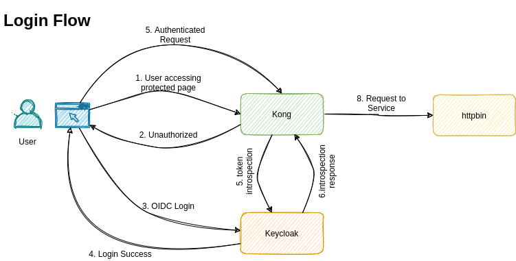

:toc: left
:figure-caption!:

[[kong-oidc-with-keycloak]]
= Kong OIDC + Keycloak + httpbin

This example repo describe how to access httpbin/any service securely via kong OIDC with keycloak.

== Prerequisites

* Docker 19.03.13 or latest
* Docker compose 1.28.2 or latest

== How to use

* Build the kong using `docker-compose build kong`
* Then `docker-compose up -d`
* Then visit http://localhost:8000
* Login using username: admin, password: admin
* Now the httpbin page will load
* To logout http://localhost:8000/auth/realms/master/protocol/openid-connect/logout?redirect_uri=http%3A%2F%2Flocalhost%3A8000 then http://localhost:8000/logout

== Explanation

=== Architecture

* Keycloak 15.0.2
* Kong 2.5.0
* keycloak-config-cli 4.2.1-rc0-15.0.1
* Postgres 13.4

=== Keycloak

Keycloak is an OpenID Connect Identity Provider (OIDC IDP).

=== Keycloak config init

Load the keycloak config into the keycloak using their API. We used this only to create clients. But you can use this for load all kind of keycloak config. Export keycloak config and use it here.

=== Kong

Kong is an advance reverse proxy with "kong-oidc" plugin.

=== Kong config init

This is just a shell script with curl command against kong admin API.

This will create

* Service
* Routes
* Plugins

=== httpbin

This is mock app. We used this as protected endpoints.

== Enterprise / Production deployment

These are the following things are minimum requirement to deploy this stack in production.

* Keycloak theme based on organization
* Import existing LDAP/AD users using keycloak user federation
* Keycloak external identity provider
* Keycloak proper user and role mapping
* Define authentication flow based on need
* Integrate monitoring and alerting system like prometheus and grafana

To handle the load

* Run keycloak as cluster
* Run postgres as cluster
* Run kong as cluster

== TODO

* Logout in kong

*Author*

[valign=center, halign=center, frame=all, grid=all, stripes=none, options=autowidth,footer]
|===
a|image::https://avatars0.githubusercontent.com/u/834529?s=86[alt="Follow @arulrajnet on Twitter", align="center", link="https://twitter.com/arulrajnet", window=_blank]
|link:https://twitter.com/arulrajnet[@arulrajnet, title="Follow @arulrajnet on Twitter", window=_blank]
|===